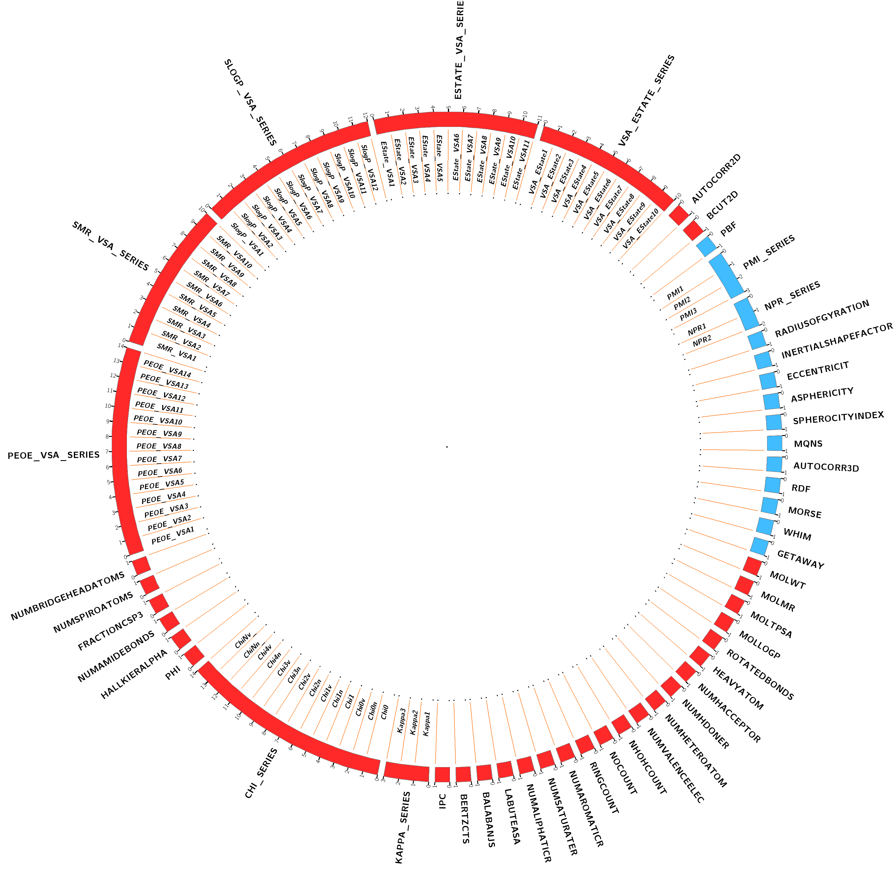
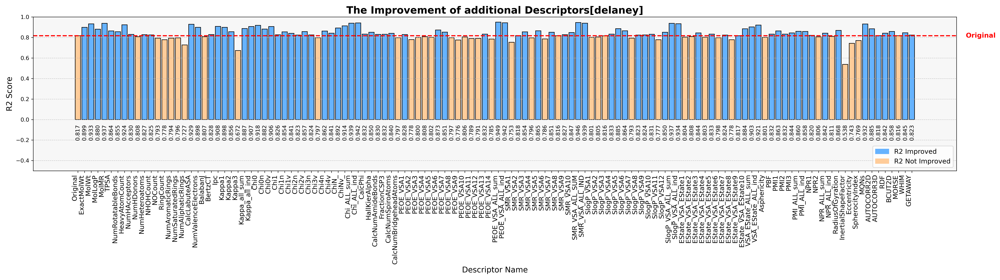
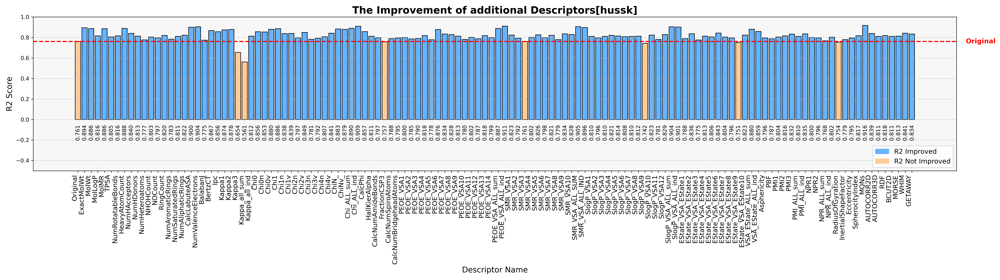
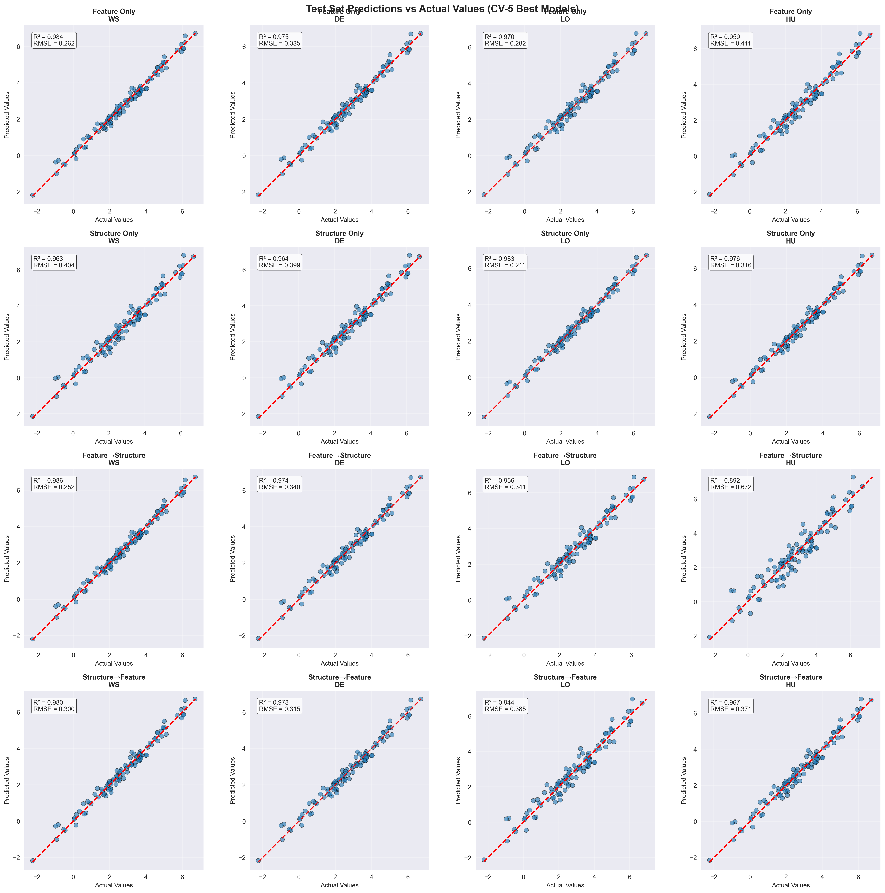
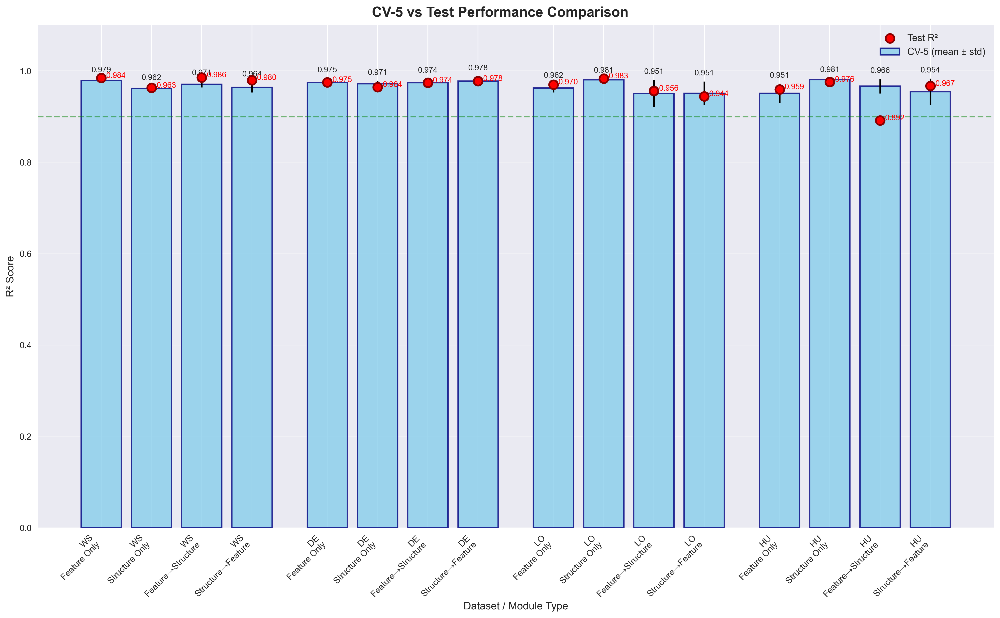
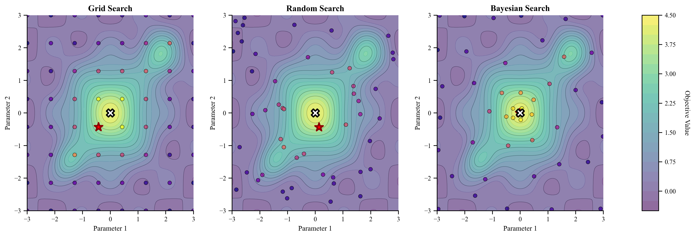

# Automated Network Optimizer (ANO) for Enhanced Prediction of Intrinsic Solubility in Drug-like Organic Compounds: A Comprehensive Machine Learning Approach

## Overview

ANO is a comprehensive framework for molecular solubility prediction using deep neural networks with automated hyperparameter optimization. The framework implements multiple optimization strategies including feature selection, model architecture search, and sequential optimization approaches to achieve state-of-the-art prediction accuracy for aqueous solubility.

<div align="center">
    <a href="./md_sources/res2.png" target="_blank">
        
    </a>
</div>

## Project Structure

```
ANO_20250607/
├── data/                           # Dataset directory
│   ├── train/                      # Training data splits
│   ├── test/                       # Test data splits
│   └── DATASET_SOURCES.md          # Dataset documentation
├── extra_code/                     # Utility modules
│   ├── ano_feature_search.py       # Feature selection with Optuna
│   ├── ano_feature_selection.py   # Molecular descriptor calculation
│   ├── molecular_loader_with_fp.py # Fingerprint generation
│   ├── learning_process_pytorch.py # PyTorch training subprocess
│   └── preprocess.py               # Data preprocessing utilities
├── result/                         # Output directory
│   ├── 1_preprocess/               # Preprocessing results
│   ├── 5_ANO_FeatureOptimization_FO/
│   ├── 6_ANO_ModelOptimization_MO/
│   ├── 7_ANO_NetworkOptimization_type1_NO1/
│   ├── 8_ANO_NetworkOptimization_type2_NO2/
│   ├── 9_ANO_result_comparison/
│   └── 10_ANO_testonly_predictions/
├── md_sources/                     # Documentation and figures
├── 0_search_comp_figures.py        # Search method comparison
├── 0_search_comp.ipynb             # Search analysis notebook
├── 1_preprocess.ipynb              # Data preprocessing pipeline
├── 2_standard_comp.ipynb           # Standard model comparison
├── 3_solubility_fps_comb_pytorch.ipynb  # Fingerprint combination analysis
├── 5_ANO_FeatureOptimization_FO.py       # Feature optimization module
├── 6_ANO_ModelOptimization_MO.py         # Model architecture optimization
├── 7_ANO_NetworkOptimization_type1_NO1.py # Feature→Structure optimization
├── 8_ANO_NetworkOptimization_type2_NO2.py # Structure→Feature optimization
├── 9_ANO_result_comparison.py            # Result comparison and analysis
├── 10_ANO_prediction_testonly.py         # Test-only dataset predictions
└── ano_final.db                          # Optuna study database
```

## System Requirements

### Dependencies
- Python 3.8 or later
- PyTorch 1.9.0 or later
- RDKit 2021.09.1 or later
- NumPy 1.21.0 or later
- pandas 1.3.0 or later
- scikit-learn 0.24.0 or later
- Optuna 2.10.0 or later
- matplotlib 3.4.0 or later
- seaborn 0.11.0 or later
- joblib 1.0.0 or later
- tqdm 4.62.0 or later
- openpyxl 3.0.0 or later

## Datasets

### Main Training Datasets
- **ws496_logS.csv**(ws): Water solubility dataset (496 compounds)
- **delaney-processed.csv**(de): ESOL dataset (Delaney, 2004)
- **huusk.csv**(hu): Huuskonen aqueous solubility dataset (2000)
- **Lovric2020_logS0.csv**(lo): Intrinsic aqueous solubility dataset (2020)

### Test-Only Datasets
- **FreeSolv.csv**: Hydration free energy database
- **Lipophilicity.csv**: ChEMBL lipophilicity dataset
- **AqSolDB.csv**: Curated aqueous solubility database (9,982 compounds)
- **BigSolDB.csv**: Large-scale solubility dataset

For detailed dataset information and citations, see `data/DATASET_SOURCES.md`.

## ANO Modules

### 1. Data Preprocessing (`1_preprocess.ipynb`)
- Standardizes SMILES strings using RDKit
- Generates molecular fingerprints (Morgan, MACCS, Avalon)
- Creates multiple data splitting strategies:
  - Random split (rm)
  - Scaffold split (sc)
  - Chemical space split (cs)
  - Cluster split (cl)
  - Physchem property split (pc)
  - Activity cliff split (ac)
  - Solubility-aware split (sa)
  - Time series split (ti)
  - Ensemble split (en)
- Performs comprehensive applicability domain (AD) analysis:
  - Three AD modes: strict, flexible, adaptive
  - Generates detailed AD reports and visualizations
  - Based on results in `result/1_preprocess_enhanced/`

### 2. Feature Optimization (`5_ANO_FeatureOptimization_FO.py`)
- Automated feature selection from 51 molecular descriptor categories
- Uses Optuna for Bayesian hyperparameter optimization
- Fixed neural network architecture: 2727 (final fingerprint, morgan+maccs+avalon)→1024→496→1
- **5-fold cross-validation** for robust evaluation
- Outputs best feature subset for each dataset/split combination

### 3. Model Optimization (`6_ANO_ModelOptimization_MO.py`)
- Optimizes neural network architecture with all features
- Searches over:
  - Number of layers (2-4)
  - Hidden units per layer
  - Dropout rates
  - Activation functions
- **5-fold cross-validation** for all evaluations

### 4. Network Optimization Type 1 - FO→MO (`7_ANO_NetworkOptimization_type1_NO1.py`)
- Feature optimization followed by model structure optimization
- First selects best features, then optimizes architecture
- **5-fold cross-validation** throughout the process
- Combines advantages of both approaches

### 5. Network Optimization Type 2 - MO→FO (`8_ANO_NetworkOptimization_type2_NO2.py`)
- Model structure optimization followed by feature optimization
- First finds best architecture, then selects features
- **5-fold cross-validation** for robust results
- Alternative sequential strategy

### 6. Result Comparison (`9_ANO_result_comparison.py`)
- Compares all ANO strategies
- Generates comprehensive visualizations
- Statistical analysis of results
- Outputs publication-ready figures and tables


## Key Features

### Molecular Representations
- **Base Fingerprints** (2727 bits total):
  - **Morgan Fingerprints**: 2048-bit circular fingerprints (radius=2)
  - **MACCS Keys**: 167 structural keys
  - **Avalon Fingerprints**: 512-bit fingerprints

- **RDKit Descriptors**: 49 categories (~882 features) - selectable via Optuna:

  **2D Descriptors (27 categories):**
  1. **MolWt** - Molecular Weight
  2. **MolLogP** - Molecular LogP
  3. **MolMR** - Molecular Refractivity
  4. **TPSA** - Topological Polar Surface Area
  5. **NumRotatableBonds** - Number of Rotatable Bonds
  6. **HeavyAtomCount** - Heavy Atom Count
  7. **NumHAcceptors** - Number of H Acceptors
  8. **NumHDonors** - Number of H Donors
  9. **NumHeteroatoms** - Number of Heteroatoms
  10. **NumValenceElectrons** - Number of Valence Electrons
  11. **NHOHCount** - NHOH Count
  12. **NOCount** - NO Count
  13. **RingCount** - Ring Count
  14. **NumAromaticRings** - Number of Aromatic Rings
  15. **NumSaturatedRings** - Number of Saturated Rings
  16. **NumAliphaticRings** - Number of Aliphatic Rings
  17. **LabuteASA** - Labute ASA
  18. **BalabanJ** - Balaban J Index
  19. **BertzCT** - Bertz Complexity Index
  20. **Ipc** - Information Content
  21. **kappa_Series[1-3]_ind** - Kappa Shape Indices (3 descriptors)
  22. **Chi_Series[13]_ind** - Chi Connectivity Indices (13 descriptors)
  23. **Phi** - Flexibility Index
  24. **HallKierAlpha** - Hall-Kier Alpha
  25. **NumAmideBonds** - Number of Amide Bonds
  26. **NumSpiroAtoms** - Number of Spiro Atoms
  27. **NumBridgeheadAtoms** - Number of Bridgehead Atoms

  **VSA Descriptors (5 series):**
  28. **PEOE_VSA_Series[1-14]_ind** - PEOE VSA (14 individual descriptors)
  29. **SMR_VSA_Series[1-10]_ind** - SMR VSA (10 individual descriptors)
  30. **SlogP_VSA_Series[1-12]_ind** - SlogP VSA (12 individual descriptors)
  31. **EState_VSA_Series[1-11]_ind** - EState VSA (11 individual descriptors)
  32. **VSA_EState_Series[1-10]** - VSA EState (10 individual descriptors)

  **rdMolDescriptors (3 categories):**
  33. **MQNs** - Molecular Quantum Numbers
  34. **AUTOCORR2D** - 2D Autocorrelation
  35. **BCUT2D** - 2D BCUT Descriptors

  **3D Descriptors (14 categories):**
  36. **FractionCSP3** - Fraction of sp3 Carbon Atoms
  37. **Asphericity** - Asphericity
  38. **PBF** - Plane of Best Fit
  39. **RadiusOfGyration** - Radius of Gyration
  40. **InertialShapeFactor** - Inertial Shape Factor
  41. **Eccentricity** - Eccentricity
  42. **SpherocityIndex** - Spherocity Index
  43. **PMI_series[1-3]_ind** - Principal Moments of Inertia (3 descriptors)
  44. **NPR_series[1-2]_ind** - Normalized Principal Moments Ratio (2 descriptors)
  45. **AUTOCORR3D** - 3D Autocorrelation
  46. **RDF** - Radial Distribution Function
  47. **MORSE** - Morse Descriptors
  48. **WHIM** - WHIM Descriptors
  49. **GETAWAY** - GETAWAY Descriptors

<div align="center">
    <a href="./md_sources/descriptors_list.png" target="_blank">
        
    </a>
    <p><i>Complete list of 49 molecular descriptor categories used in ANO</i></p>
</div>

### Optimization Strategies
- **Bayesian Optimization**: Efficient hyperparameter search using Optuna
- **Cross-Validation**: **5-fold CV used throughout all optimization processes**
- **Memory Management**: Subprocess-based training to prevent memory leaks
- **Parallel Processing**: Multi-dataset/split processing support

### Evaluation Metrics
- R² (coefficient of determination)
- RMSE (root mean squared error)
- MAE (mean absolute error)
- Coverage analysis for applicability domain (leverage-based)

## Quick Start

### 1. Data Preprocessing
```bash
jupyter notebook 1_preprocess.ipynb
```

### 2. Run ANO Modules
```bash
# Feature optimization (FO)
python 5_ANO_FeatureOptimization_FO.py

# Model optimization (MO)
python 6_ANO_ModelOptimization_MO.py

# Network optimization Type 1 (FO→MO)
python 7_ANO_NetworkOptimization_type1_NO1.py

# Network optimization Type 2 (MO→FO)
python 8_ANO_NetworkOptimization_type2_NO2.py

# Compare results
python 9_ANO_result_comparison.py

```

### 3. Configuration
All modules support configuration through script headers:
- `N_TRIALS`: Number of Optuna trials (default: 100)
- `N_EPOCHS`: Training epochs (default: 100)
- `SPLIT_TYPES`: Data splitting strategies to use
- `DATASETS`: Training datasets to process

## Results

Results are saved in the `result/` directory with the following structure:
- Model checkpoints
- Optuna study databases
- Performance metrics (CSV/Excel)
- Visualizations (PNG/PDF)
- LaTeX tables for publication

### Performance Examples

<div align="center">
    <a href="./md_sources/r2_score_ws_individual.png" target="_blank">
        
    </a>
    <p><i>R² scores for WS dataset with DNN</i></p>
</div>

<div align="center">
    <a href="./md_sources/r2_score_de_individual.png" target="_blank">
        
    </a>
    <p><i>R² scores for DE dataset with DNN</i></p>
</div>

<div align="center">
    <a href="./md_sources/r2_score_lo_individual.png" target="_blank">
        
    </a>
    <p><i>R² scores for LO dataset with DNN</i></p>
</div>

<div align="center">
    <a href="./md_sources/r2_score_hu_individual.png" target="_blank">
        
    </a>
    <p><i>R² scores for HU dataset with DNN</i></p>
</div>

<div align="center">
    <a href="./md_sources/test_predictions_vs_actual.png" target="_blank">
        
    </a>
    <p><i>Test set predictions vs actual values across all ANO modules and datasets</i></p>
</div>

<div align="center">
    <a href="./md_sources/cv_test_comparison.png" target="_blank">
        
    </a>
    <p><i>Cross-validation vs test set performance comparison</i></p>
</div>

## Other Notebooks

### Analysis Notebooks
1. **0_search_comp.ipynb**
   - Comparison of optimization algorithms
   - Bayesian vs. Grid Search vs. Random Search
   - Demonstrates superior efficiency of Bayesian optimization

<div align="center">
    <a href="./md_sources/0_search_comp_figures/fig1_search_space_comparison.png" target="_blank">
        
    </a>
    <p><i>Comparison of search strategies: Grid Search vs Random Search vs Bayesian Search</i></p>
</div>

### Model Comparison

<div align="center">
    <a href="./md_sources/plots/1_standard_model_compare_sa_maccs.png" target="_blank">
        
    </a>
    <p><i>Comparison of different machine learning models</i></p>
</div>

2. **2_standard_comp.ipynb**
   - Benchmark comparison with traditional ML models
   - Random Forest, XGBoost, SVM implementations
   - Performance evaluation across different datasets and splits
   - Deep learning models using **TensorFlow** for comparison

3. **2_standard_comp_pytorch_optimized.py**
   - PyTorch-optimized version of standard comparisons
   - Efficient implementation of baseline models
   - Direct comparison with ANO framework results

4. **3_solubility_fps_comb_pytorch.ipynb**
   - Analysis of fingerprint combinations using PyTorch
   - Performance evaluation across different molecular representations
   - Automated feature importance analysis
   - Real-time feature selection optimization
   - **5-fold cross-validation** for all experiments

5. **4_solubility_feature_deeplearning.ipynb**
   - Deep learning approaches for solubility prediction
   - Feature engineering and selection strategies
   - Comparison of different neural network architectures
   - Uses both **TensorFlow** and PyTorch implementations

## Citation

If you use the ANO framework in your research, please cite:

```bibtex
@software{ano_framework_2025,
  title={ANO: Adaptive Network Optimization for Molecular Solubility Prediction},
  author={Lee, Seungjin},
  year={2025},
url={https://github.com/arer90/ANO_solubility_prediction}
```

## License

This project is licensed under the MIT License - see the LICENSE file for details.

## Acknowledgments

- RDKit development team for the cheminformatics toolkit
- Optuna team for the hyperparameter optimization framework
- PyTorch team for the deep learning framework
- TensorFlow team for the deep learning framework

## Contact

For questions or collaborations, please open an issue on the GitHub repository.