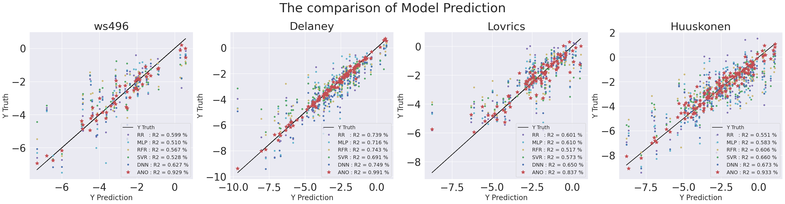
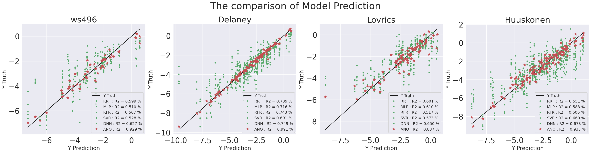
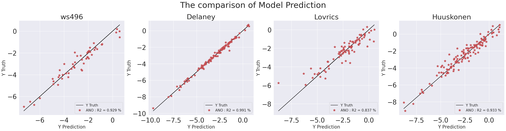
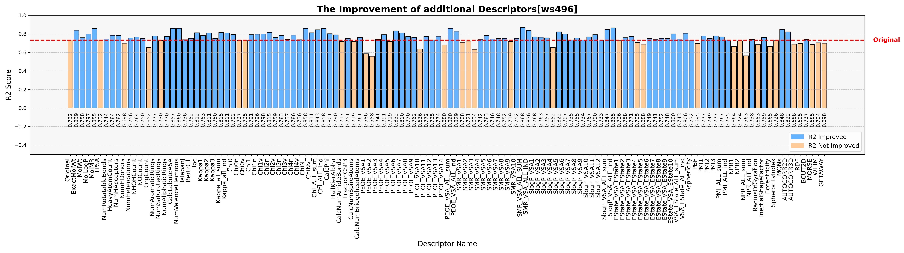
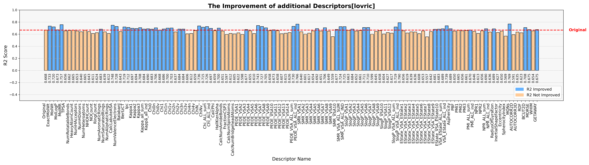
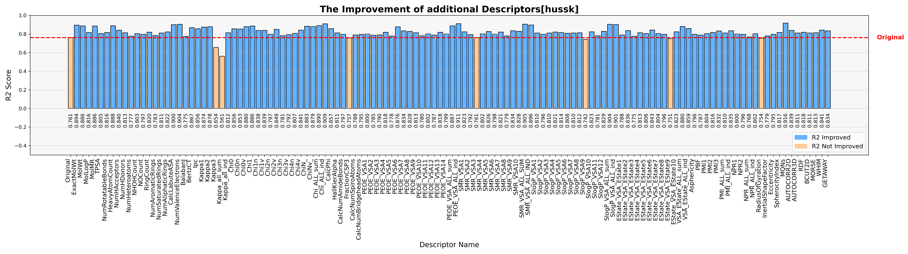

# Automated Network Optimizer (ANO) for Enhanced Prediction of Intrinsic Solubility in Drug-like Organic Compounds: A Comprehensive Machine Learning Approach

## Overview
This repository presents a novel approach to predicting aqueous solubility of drug-like organic compounds using our Automated Network Optimizer (ANO) framework. By integrating advanced machine learning techniques with automated feature selection and hyperparameter optimization, we achieve state-of-the-art prediction accuracy for intrinsic solubility (logS).

<div align="center">
    <a href="./result_prior/res1.png" target="_blank">
        
    </a>
</div>

<div align="center">
    <a href="./result_prior/res2.png" target="_blank">
        
    </a>
</div>

<div align="center">
    <a href="./result_prior/res3.png" target="_blank">
        
    </a>
</div>

## System Requirements
### Dependencies
- Python 3.12 or later
- TensorFlow 2.15.0 (Linux/MacOS/WSL)
- TensorFlow 2.15.0-GPU (Windows)
- RDKit 2024.3.1
- pandas 2.2.1
- scikit-learn 1.4.1.post1
- seaborn 0.13.2
- matplotlib 3.8.3
- optuna 3.5.0

## Repository Structure

### Jupyter Notebooks
1. **1_standard_ML.ipynb**
   - Comprehensive evaluation of traditional ML approaches
   - Random Forest, XGBoost, and SVM implementations
   - Baseline performance metrics and comparative analysis

2. **2_solubility_fingerprint_comparison.ipynb**
   - Detailed analysis of molecular fingerprint methods
   - Evaluation of ECFP, MACCS, and custom fingerprints
   - Performance comparison across fingerprint types

3. **3_ANO_with_feature_checker.ipynb**
   - Implementation of ANO framework
   - Automated feature importance analysis
   - Real-time feature selection optimization

4. **4_ANO_feature.ipynb**
   - Optimal physicochemical feature search using ANO

5. **5_ANO_structure.ipynb**
   - Hyperparameter optimization using ANO

6. **6_ANO_network_[fea_struc].ipynb**
   - Network architecture optimization based on optimal physicochemical features

7. **7_ANO_network_[struc_fea].ipynb**
   - Network architecture optimization based on optimal hyperparameters

8. **7_Solubility_final_HPO_proving.ipynb**
   - Performance validation of final ANO model

9. **8_solubility_xai.ipynb**
   - Model explainability analysis
   - Permutation importance and SHAP evaluation
   - Correlation analysis between physicochemical features and logS
   - Implementation of Lipinski's Rule of 5

### Core Python Modules
- **basic_model.py**
  - Foundation architecture for fingerprint analysis
  - Modular design for easy extension
  - Comprehensive validation methods

- **feature_search.py**
  - Feature search implementation for ANO (used in 4_ANO_feature.ipynb)

- **feature_selection.py**
  - Feature selection implementation for ANO (used in 5_ANO_structure.ipynb, 6_ANO_network_[fea_struc].ipynb, 7_ANO_network_[struc_fea].ipynb)

- **learning_model.py**
  - ANO learning model implementation
  - Used in deep learning and feature optimization notebooks

## Key Innovations
- 49 carefully selected chemical descriptors for target dataset
- Fast and efficient selections of chemical descriptors and hyperparameters in machine learning models

<div align="center">
    
</div>

- These are the prediction results of deep learning models using individual solubility features to verify the improvement of the basic model.

<div align="center">
    
</div>

<div align="center">
    
</div>

<div align="center">
    
</div>

<div align="center">
    
</div>

## Model Availability
Pre-trained models and complete results are available at:
https://huggingface.co/arer90/ANO_solubility_prediction/tree/main

## Version
Current Version: 1.0.2 (2024.11)

## License
This project is licensed under the MIT License - see the LICENSE file for details.

## Citation
If you use this work in your research, please cite:

```bibtex
@article{ANO2024solubility,
  title={Prediction of intrinsic solubility for drug-like organic compounds using Automated Network Optimizer (ANO) for physicochemical feature and hyperparameter optimization},
  author={Chung, Young Kyu and Lee, Seung Jun and Lee, Jonggeun and Cho, Hyunwoo and Kim, Sung-Jin and Huh, June},
  journal={ChemRxiv},
  year={2024},
  doi={10.26434/chemrxiv-2024-mp291}
}
```
